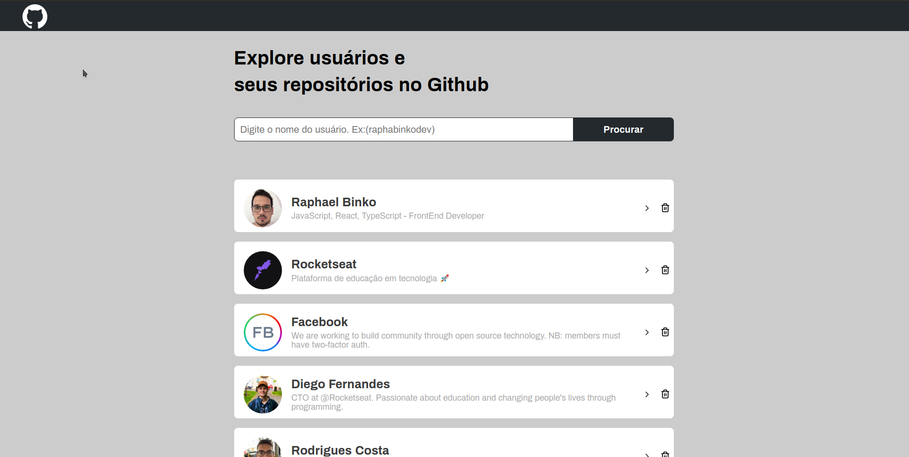
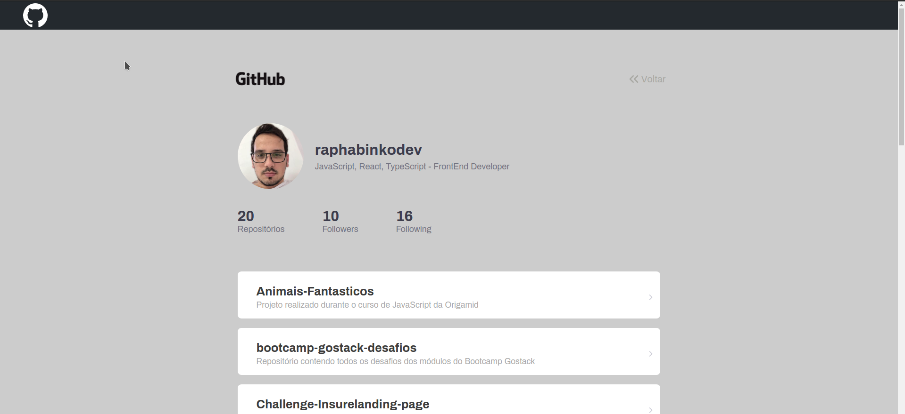

# Github Users

## Aplicação
<center></center>
<br /> <br />

<center></center>

<br/> <br/>
Projeto desenvolvido individualmente com API do Github, utilizando ReactJS (TypeScript).

### API
<a href="https://api.github.com/">Clique aqui</a>

## Instalação

Para fazer a instalação basta acessar a pasta de seu interesse pelo seu console e:

```bash
git clone https://github.com/raphabinkodev/github-explorer
```

## Inicializando
Já com projeto aberto em seu editor de código, no terminal basta dar o seguinte comando para instalar todas as dependências utilizadas em meu projeto:
```bash
yarn
```
Posteriormente basta usar o seguinte comando para poder inicializar a aplicação em seu navegador:
```bash
yarn start
```

## Contribuição
Esse é um projeto individual, com intuito de aprendizado, se quiser me ajudar basta dar uma Star, ficarei muito grato.

